# TrackQuest

**Meta Quest 3 controller tracking for TV games, a bit like a Wii sensor bar.**

Put the Quest on a shelf facing the players. Its cameras track the two controllers, and any computer on the same Wi-Fi (Steam Deck, PC, Mac) runs the game on the TV. The controllers become light guns, swords or pointers.

The first game is **DuckQuest**: a retro, NES-style duck shooter with a dog, a very large bear and a princess balloon party. Everything is plain HTML and Python, with no installs and no build step.

| | | |
|---|---|---|
| 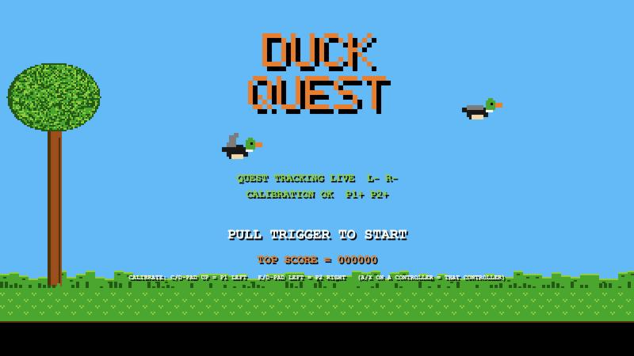 | 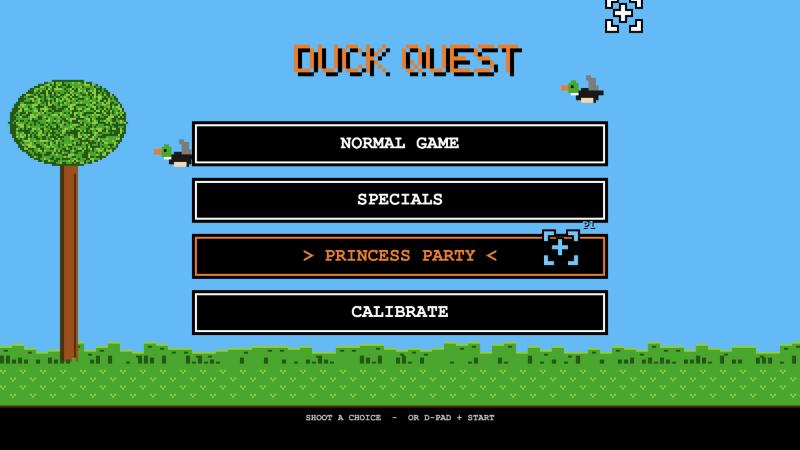 | 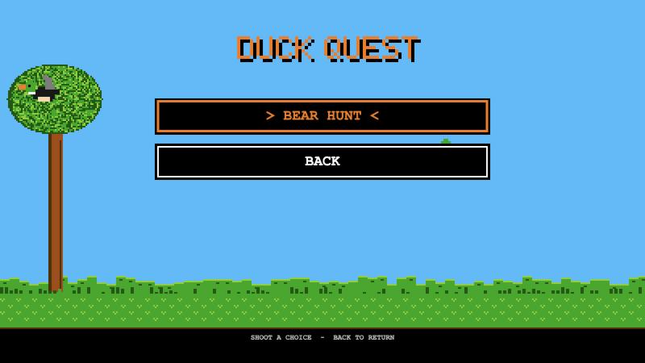 |
| 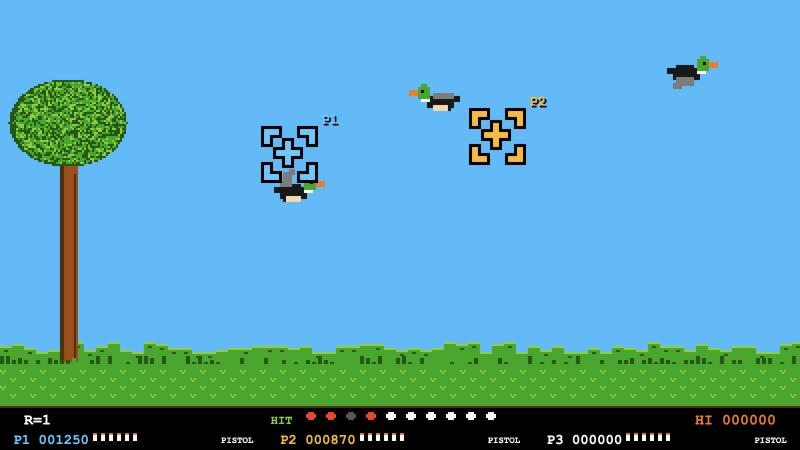 | 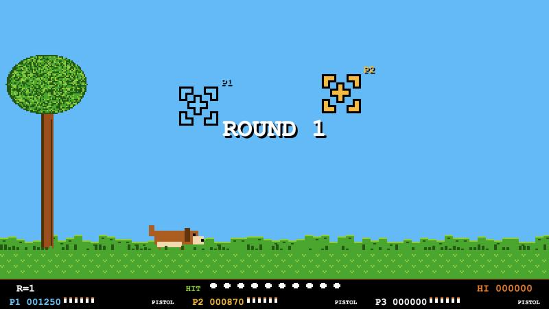 | 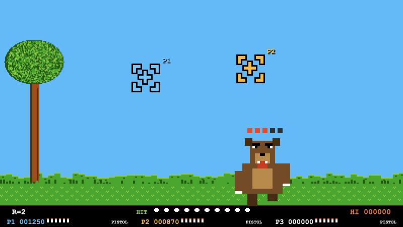 |
| 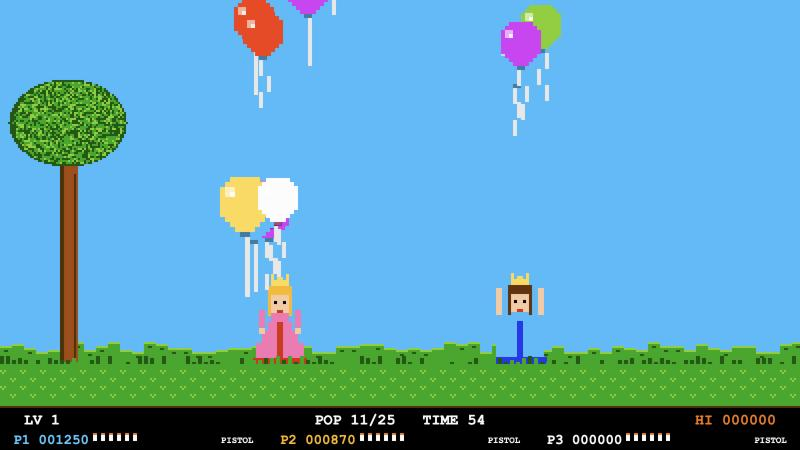 | 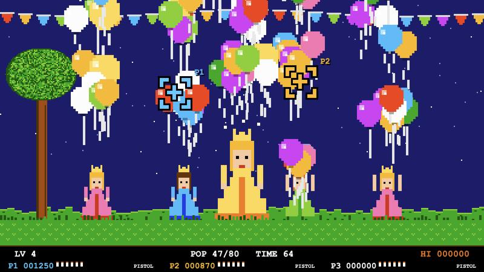 | 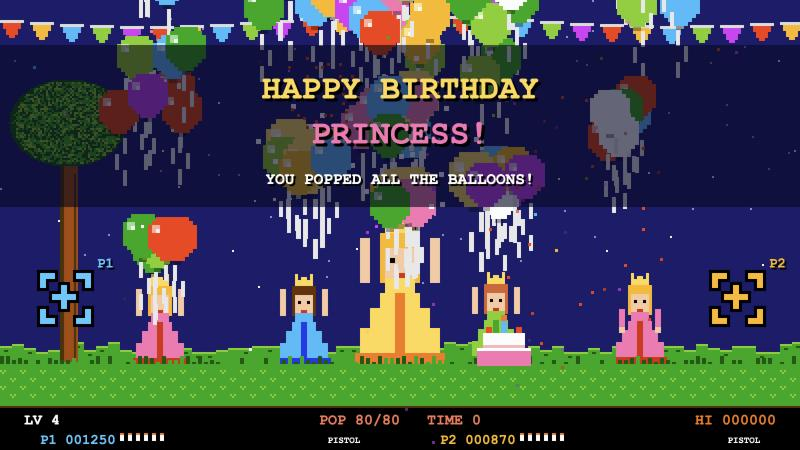 |

*All screenshots are real frames from the game (demo scenes: add `?demo=menu`, `ducks`, `bear`, `party4`, ... to the address).*

## How it works

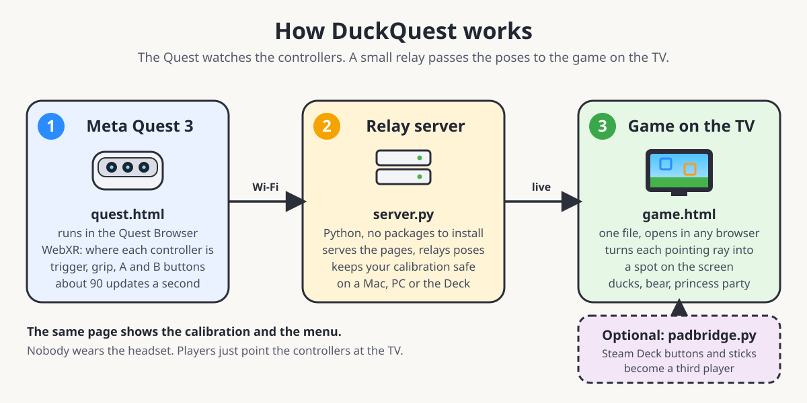

1. **`duckquest/quest.html`** runs in the Quest Browser as a WebXR page. It sends the controllers' pose (position, orientation), trigger, grip and buttons to the server about 90 times a second.
2. **`duckquest/server.py`** (Python standard library only) serves the game, relays poses over a WebSocket, and keeps a backup of the calibration.
3. **`duckquest/game.html`** is the game, one file with no build step. It turns each controller's pointing ray into a position on the TV using a per-controller calibration (four corners and a bullseye).
4. **`duckquest/padbridge.py`** is optional. It reads the Steam Deck's own buttons from `/dev/input` and sends them to the game, so the Deck itself works as a controller even where the browser can't see it.

## Where the Quest goes

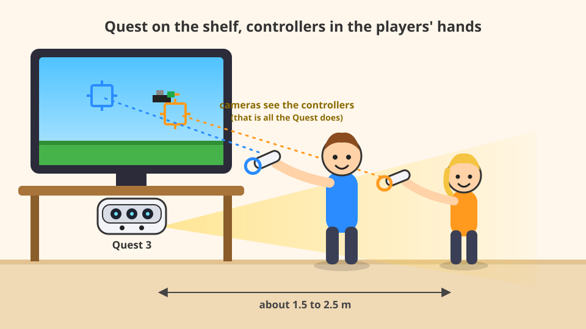

- Put it **under or beside the TV, facing the players**, at about chest height and tilted up a little.
- Keep the players **1.5 to 2.5 m** away so the cameras see both controllers.
- Keep it **still** (recalibrate if it moves), with even light in the room.
- Cover the proximity sensor with tape so it stays awake when nobody wears it.

The Quest only watches the controllers, so nobody needs a headset on. More placements (above the TV, on the chest, on a boom) are in [docs/placement.md](docs/placement.md).

## What's in the game

- **Normal game:** ducks, a dog that laughs or catches them, and rounds that get faster.
- **Bear hunt (specials):** a big bear runs toward you. It takes five hits, growls, and attacks if it arrives.
- **Princess party:** four levels of rising balloons released by princesses. A golden balloon pops everything on screen. The last level is a birthday party with a finale. Use `?name=Lauri` to put a name on the cake.
- **Three weapons:** pistol, shotgun (three pellets), machine gun (hold the trigger).
- **Two players:** the left controller is P1 and the right is P2. The Deck's controls are P3.
- **Retro everything:** pixel sprites and a chiptune soundtrack, all generated by code, so there are no asset files. Press **G** for the old smooth look.

## Quick start

```bash
git clone https://github.com/taituo/duckquest
cd duckquest
python3 duckquest/server.py
```

Open the printed `http://localhost:8080` on the TV. On the Quest, open the printed `https://<ip>:8443/quest.html`, accept the certificate warning once, and press **Start tracking**. Then calibrate from the menu and play. Details, controls and troubleshooting are in [`duckquest/README.md`](duckquest/README.md).

Using a Steam Deck as the TV screen from a Mac? See [`CLAUDE.md`](CLAUDE.md) and `scripts/deck.sh`. For the Quest over USB, `scripts/quest.sh` can wake it, grab a frame of its view and open the tracker page.

## Calibration

Calibration is per controller, and you do it one player at a time:

1. **P1 (left):** aim at the four corners of the picture, then at the bullseye.
2. **P2 (right):** the same, as its own step. Press Start or B to skip a controller.

It works wherever the Quest stands, as long as it can see the controllers. The result is saved in `duckquest/calib.json` (not committed) with timestamped backups. There is a live view of each controller's pointing direction, tracking quality and trigger while you calibrate.

## Latency and smoothness

Measured with the debug overlay (**D**): about 90 pose updates per second, 11 ms between updates on average, occasional gaps of 150 ms or more on Wi-Fi. The game smooths the aim with a One Euro filter and bridges short gaps by extrapolating the motion. For the lowest latency, run the server on the same machine as the game and keep the Quest on 5 GHz Wi-Fi.

## Notes

- A browser tracker is the quick way to start. A native Quest app (see [idea 12](docs/ideas/12-native-quest-app.md)) would add stability, not accuracy.
- The Quest sleeps when it is not worn. Cover the proximity sensor with tape or run `scripts/quest.sh wake` ([keep it awake](docs/keep-awake.md)).
- Controllers lying still on a table go to sleep and stop being tracked. Pick them up to wake them.

## More

- [How Quest tracking works](docs/tracking-basics.md) · [Where to place the Quest](docs/placement.md) · [Keeping it awake](docs/keep-awake.md) · [Connecting devices](docs/connecting-and-sharing.md)
- [More game ideas](docs/ideas/) (sword duels, head tracking, a "super Wii remote" and others)

## Credits

DuckQuest is a tribute to arcade and NES light-gun games. It is not affiliated with Nintendo, and all art, sounds and music here are original code. The birthday tune is the traditional "Happy Birthday to You". It was written with [Claude Code](https://claude.com/claude-code) on a Mac, a Steam Deck and a Meta Quest 3.

License: [MIT](LICENSE).
